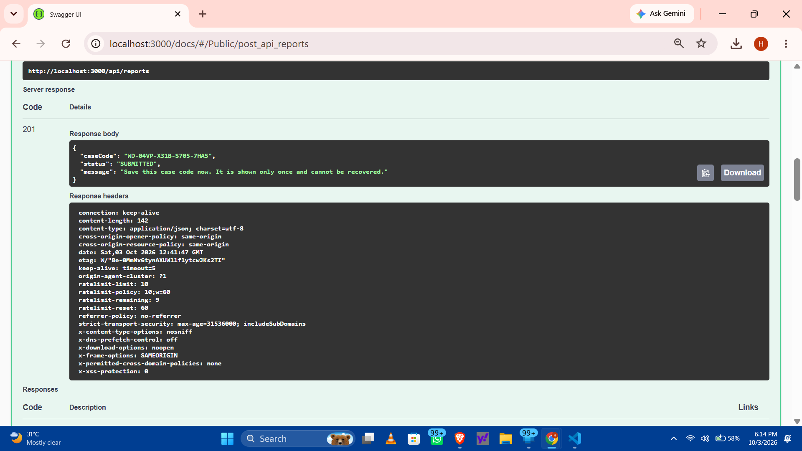
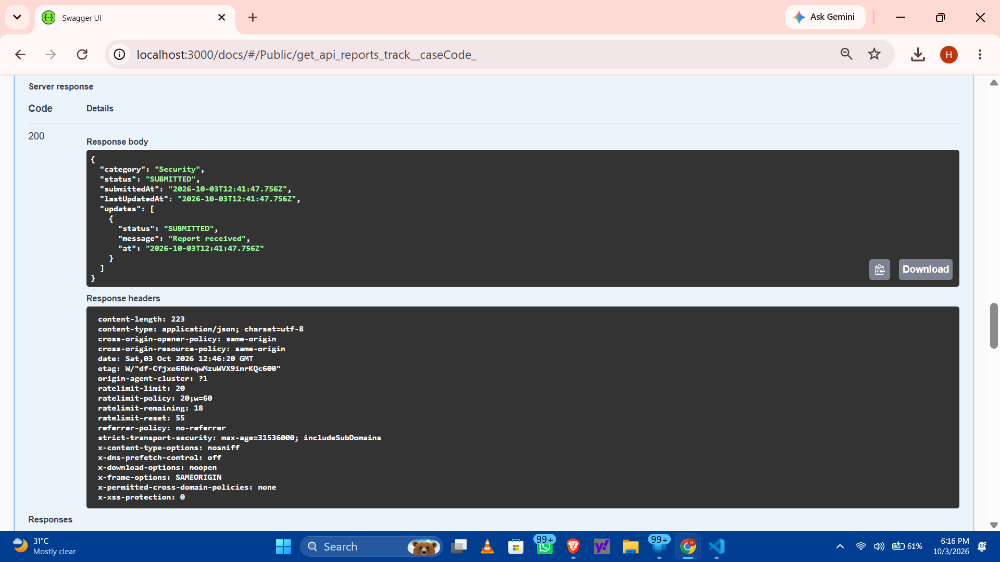
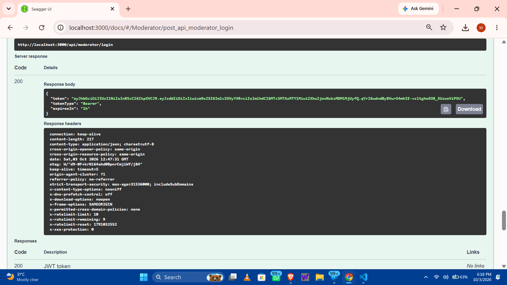
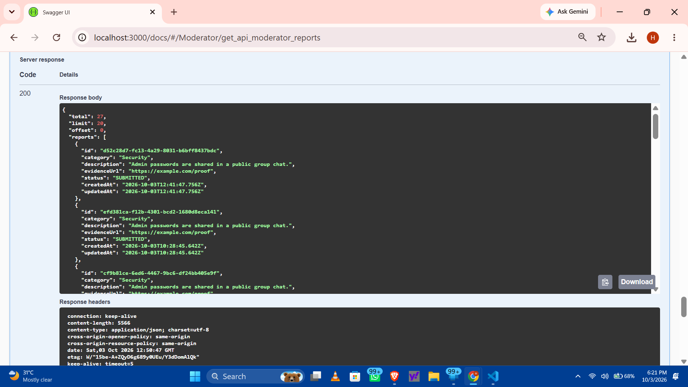
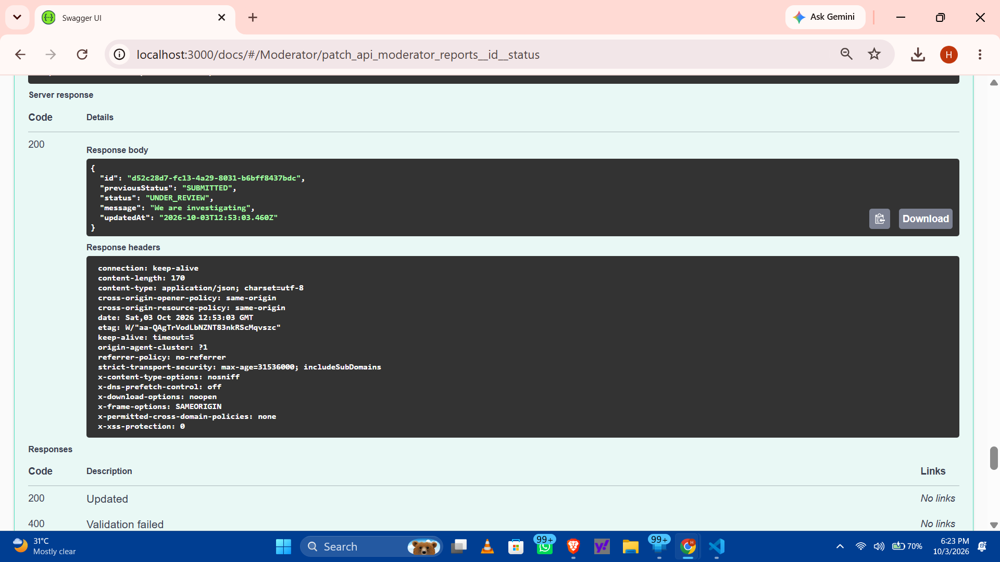
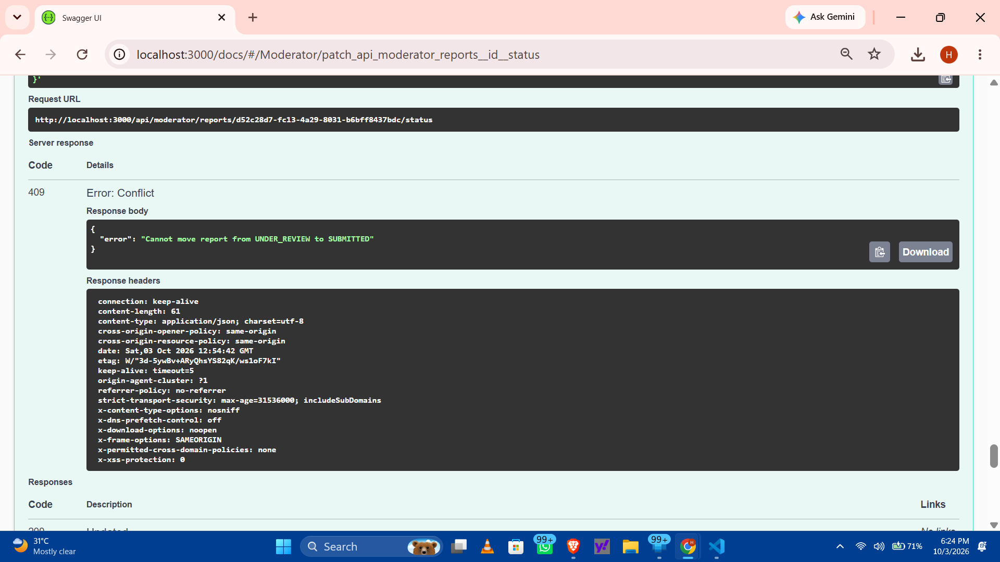

# WhistleDrop: Speak Without Being Seen

A backend for a confidential reporting system. Anyone can submit a report with no account and no identity. Moderators can review and manage reports. Reporters track progress using a private case code. Nothing in the system links a report to a person.

**Stack:** Node.js, Express, SQLite (better-sqlite3), JWT, bcrypt, zod, Jest + Supertest, Swagger UI.

## Setup

```bash
git clone <https://github.com/himanshhuu973/whistledrop.git> && cd whistledrop
npm install
cp .env.example .env     # then edit the secrets (see below)
npm run seed             # creates the moderator account from .env
npm start                # http://localhost:3000
npm test                 # runs the automated tests
```

Generate strong secrets for `JWT_SECRET` and `CASE_CODE_PEPPER` with:
`node -e "console.log(require('crypto').randomBytes(32).toString('hex'))"`

Interactive API docs (Swagger UI): `http://localhost:3000/docs`

## Endpoints

| Method | Endpoint | Auth | Purpose |
|---|---|---|---|
| POST | `/api/reports` | None | Submit an anonymous report, returns a case code |
| GET | `/api/reports/track/:caseCode` | None (case code is the secret) | Check status and public updates |
| POST | `/api/moderator/login` | None | Moderator login, returns a JWT |
| GET | `/api/moderator/reports` | Moderator | List reports. Filters: `category`, `status`, `search`, `limit`, `offset` |
| GET | `/api/moderator/reports/:id` | Moderator | View one report and its history |
| PATCH | `/api/moderator/reports/:id/status` | Moderator | Change status and add a short update |
| GET | `/health` | None | Health check |

### Status workflow

```
SUBMITTED -> UNDER_REVIEW -> RESOLVED
                          -> DISMISSED
```
`RESOLVED` and `DISMISSED` are terminal (the case is permanently closed). Any other transition returns `409`.

### Status codes used

| Code | Meaning |
|---|---|
| 200 / 201 | Success / created |
| 400 | Validation failed, malformed JSON, bad case code format, bad filter |
| 401 | Missing, invalid or expired token; wrong login |
| 404 | Unknown case code, report or route |
| 409 | Invalid status transition |
| 413 | Body too large (limit 20 KB) |
| 429 | Rate limit exceeded |

## Example requests and responses

**Submit a report**
```bash
curl -X POST http://localhost:3000/api/reports -H "Content-Type: application/json" -d '{
  "category": "Corruption",
  "description": "Vendor payments are being routed to a personal account.",
  "evidenceUrl": "https://example.com/doc"
}'
```
```json
201
{ "caseCode": "WD-Z9N6-5QPD-6VSX-PFYR", "status": "SUBMITTED",
  "message": "Save this case code now. It is shown only once and cannot be recovered." }
```

**Validation error**
```json
400
{ "error": "Validation failed",
  "details": [{ "field": "category", "message": "category must be one of: Security, Harassment, Corruption, Technical, Other" }] }
```

**Track a report**
```bash
curl http://localhost:3000/api/reports/track/WD-Z9N6-5QPD-6VSX-PFYR
```
```json
200
{ "category": "Corruption", "status": "UNDER_REVIEW",
  "submittedAt": "2026-10-02T18:45:19.310Z", "lastUpdatedAt": "2026-10-02T18:45:19.755Z",
  "updates": [
    { "status": "SUBMITTED", "message": "Report received", "at": "2026-10-02T18:45:19.310Z" },
    { "status": "UNDER_REVIEW", "message": "We are investigating", "at": "2026-10-02T18:45:19.755Z" } ] }
```
Unknown code: `404 { "error": "No report found for this case code" }`

**Moderator login**
```bash
curl -X POST http://localhost:3000/api/moderator/login -H "Content-Type: application/json" \
  -d '{"username":"moderator","password":"<your password>"}'
```
```json
200
{ "token": "<jwt>", "tokenType": "Bearer", "expiresIn": "1h" }
```

**List reports with filters**
```bash
curl "http://localhost:3000/api/moderator/reports?category=Corruption&status=SUBMITTED" -H "Authorization: Bearer <jwt>"
```
```json
200
{ "total": 1, "limit": 20, "offset": 0,
  "reports": [{ "id": "3734fd2e-2bd9-4166-873f-a48919f69f7e", "category": "Corruption",
    "description": "Vendor payments are being routed to a personal account.",
    "evidenceUrl": "https://example.com/doc", "status": "SUBMITTED",
    "createdAt": "2026-10-02T18:45:19.310Z", "updatedAt": "2026-10-02T18:45:19.310Z" }] }
```

**Update status**
```bash
curl -X PATCH http://localhost:3000/api/moderator/reports/<id>/status -H "Authorization: Bearer <jwt>" \
  -H "Content-Type: application/json" -d '{"status":"UNDER_REVIEW","message":"We are investigating"}'
```
```json
200
{ "id": "3734fd2e-...", "previousStatus": "SUBMITTED", "status": "UNDER_REVIEW",
  "message": "We are investigating", "updatedAt": "2026-10-02T18:45:19.755Z" }
```
Invalid transition: `409 { "error": "Cannot move report from SUBMITTED to RESOLVED" }`

## How anonymity is maintained

1. **No accounts.** Submitting and tracking need no login, so there is no identity to store.
2. **Nothing identifying is stored.** The database has no IP address, user agent, email or session column. Reports hold only category, description, evidence URL, status and timestamps.
3. **No request logging.** There is no access logger, and request bodies and headers are never logged. Error logs contain only the error message.
4. **Case codes are secrets and are hashed.** Codes are 80 bits of CSPRNG output (`crypto.randomBytes`), roughly 1.2 x 10^24 possibilities, so they cannot be guessed. Only an HMAC-SHA256 hash (keyed with `CASE_CODE_PEPPER`) is stored. The plaintext code is shown once and never saved, so a leaked database cannot reveal codes, and moderators cannot see them.
5. **Moderators only see an internal UUID.** Moderator queries select an explicit column list that excludes the hash, and nothing links the UUID to the case code except a one-way hash.
6. **Brute-force protection.** Tracking is limited to 20 requests/min per client and submission to 10/min. Limits are kept in memory only, so IPs are never written to disk.
7. **Generic errors.** Wrong username and wrong password return the same message, and login timing is equalised with a dummy bcrypt comparison.
8. **Public tracking exposes minimal data.** Reporters see category, status and the moderator's status messages, but never the internal ID or description.

**Known limit:** a reporter's network location is still visible to the hosting provider and any proxy (for example, a CDN). For strong anonymity, reporters should use Tor or a VPN, and the service should be hosted without access logs. Also, free-text descriptions can contain identifying details, which no backend can prevent.

## Design decisions and assumptions

- **Strict, linear workflow.** Terminal states cannot be reopened. This also serves as the "permanently close a case" feature.
- **409 for invalid transitions.** The request is well-formed (so not 400) but conflicts with the current state of the resource.
- **Atomic status updates.** Read, validate and write happen in one SQLite transaction, so concurrent updates cannot skip the workflow.
- **Status messages are public to the reporter.** Moderators should not put sensitive details in them. The message is optional, max 500 characters.
- **Description is private to moderators.** Reporters do not get it back.
- **JWT for moderators.** HS256, 1 hour expiry, role claim checked. Moderator accounts are created with `npm run seed` (bcrypt, cost 12), so there are no default credentials in the code.
- **Case-code format.** `WD-XXXX-XXXX-XXXX-XXXX` using Crockford base32 (no I, L, O, U). Lookups ignore case and dashes.
- **Assumptions:** one moderator role with equal permissions, a single-instance deployment (SQLite and in-memory rate limits), and HTTPS handled by the hosting platform. When behind a proxy, set `TRUST_PROXY=1`.

## Project structure

```
src/
  app.js  server.js  config.js  db.js  openapi.js
  routes/ public.js moderator.js
  middleware/ auth.js errorHandler.js
  utils/ caseCode.js workflow.js validate.js errors.js
scripts/seed.js
tests/api.test.js
screenshots/
```

## Tests

`npm test` runs 15 integration tests covering submission, validation, case-code tracking, auth failures, filters, the full status workflow, invalid transitions, and checks that moderator responses and the database never expose case codes.

## Screenshots

Add your Postman or Swagger screenshots to `screenshots/` and link them here:








## Possible future work

Evidence file upload, moderator audit log, multiple moderator roles, Redis-backed rate limiting, deployment with a Postgres database.
